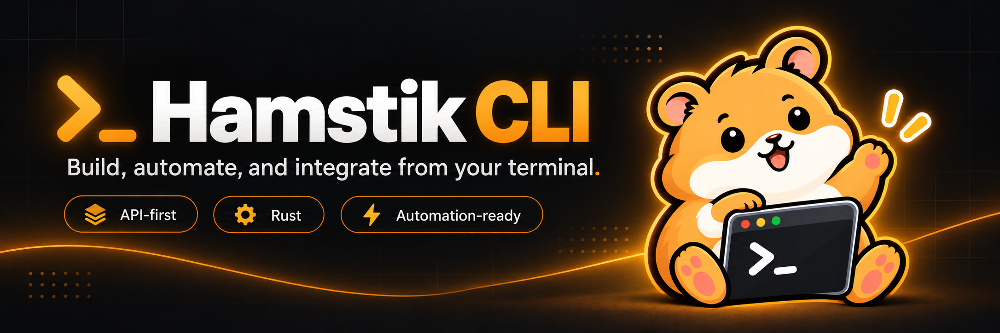
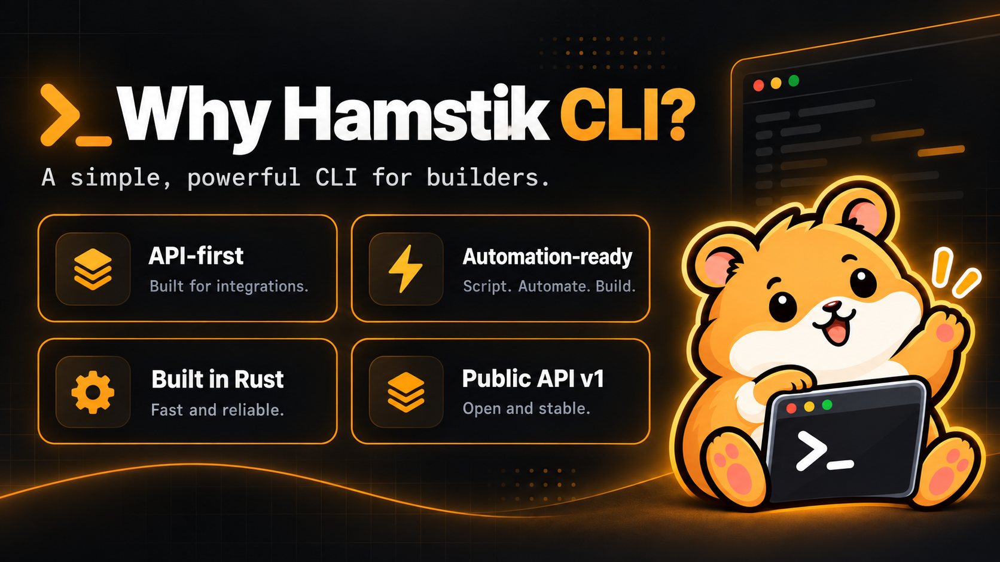
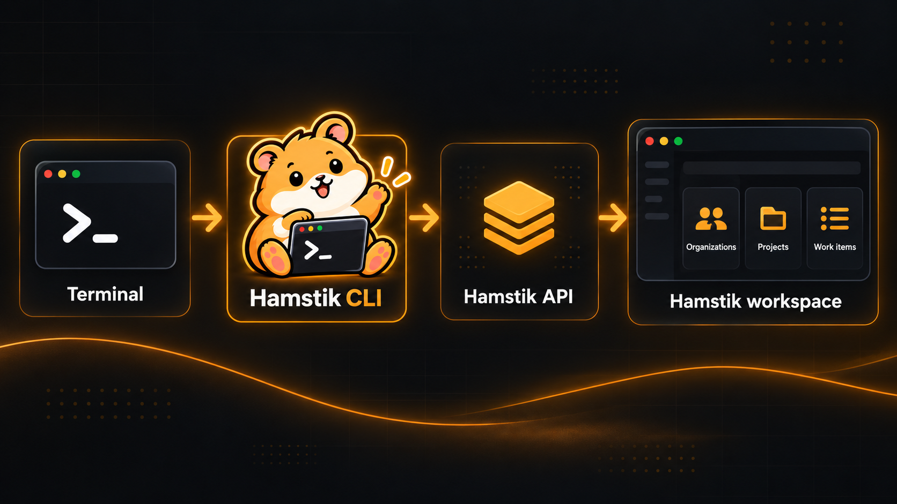

<p align="center">
  
</p>

Hamstik CLI is the official native command-line interface for
[Hamstik](https://hamstik.com), built for developers, automation, CI/CD, and
coding agents.

It talks to Hamstik exclusively through the documented **Hamstik Public API v1**
under `/api/v1`, making the same platform capabilities available to terminals,
scripts, and agent workflows.

> **Status:** Pre-alpha. The repository currently contains the project foundation
> and the API contract; end-user CLI workflows are still under development.

[](https://github.com/bbs-steven/hamstik-cli/actions/workflows/ci.yml)
[](LICENSE)

## Quick start

The CLI is not yet distributed as an installable package. Build it from source
with a Rust toolchain:

```bash
git clone https://github.com/bbs-steven/hamstik-cli.git
cd hamstik-cli
cargo build
cargo run -p hamstik-cli -- --help
cargo run -p hamstik-cli -- --version
```

## Why Hamstik CLI?



- **API-first** — the CLI is built against the documented Hamstik Public API,
  not private server internals. What the API allows, the CLI does; what it
  doesn't, the CLI won't pretend to.
- **Automation-ready** — designed from the start for terminals, scripts,
  CI/CD pipelines, and coding agents, with a stable machine-facing contract in
  mind.
- **Native Rust binary** — no Node.js, Python, or other language runtime is
  required to build or run it.
- **Frozen API contract** — the repository carries a checked-in OpenAPI
  snapshot of Hamstik Public API v1 so CLI development has a reproducible
  reference as the platform evolves.

## How it works



```text
Terminal / automation / coding agent
              ↓
          Hamstik CLI
              ↓
      Hamstik Public API v1
              ↓
        Hamstik workspace
```

Hamstik CLI does not reach into Hamstik's database or application internals.
Everything goes through the documented Public API under `/api/v1`. The
checked-in OpenAPI snapshot gives CLI development a reproducible contract while
the live Hamstik service remains the authoritative implementation.

## Current capabilities

The repository is early in its implementation. Today it provides:

- a native Rust workspace that builds the `hamstik` executable;
- the root CLI parser with `--help` and `--version`;
- the `hamstik-api-client` crate foundation for the Hamstik Public API v1;
- cross-platform CI on Linux, Windows, and macOS.

Command families such as authentication, context, organizations, projects, and
work items are specified in the design documents but are **not implemented
yet**. See the [design documents](#design-documents) for where the CLI is
headed.

## Build from source

Prerequisites:

- Git
- A Rust toolchain — install it with [rustup](https://rustup.rs/); the
  repository pins its toolchain through `rust-toolchain.toml`, which `cargo`
  picks up automatically

No Node.js, Python, or other language runtime is required.

```bash
cargo build --workspace
cargo test --workspace
cargo run -p hamstik-cli -- --help
```

## Repository structure

```text
.github/       CI workflows and repository governance
assets/        README, social-preview, and mascot artwork
crates/        Rust workspace (hamstik-cli, hamstik-api-client)
design/        Product requirements and technical specification
openapi/       Frozen Hamstik Public API v1 OpenAPI snapshot
skills/        Hamstik Agent Skill materials
```

## API contract

Hamstik CLI uses only the public API under `/api/v1`. The checked-in
[`openapi/hamstik-v1.json`](openapi/hamstik-v1.json) is the frozen development
snapshot of the Hamstik Public API v1 contract used for CLI development and
contract testing — see [`openapi/README.md`](openapi/README.md) for how it is
maintained.

CLI code must not silently depend on private Hamstik web-app or server
internals, and contract changes are synchronized intentionally rather than
casually.

## Development

Quality gates, matching CI exactly:

```bash
cargo fmt --all --check
cargo clippy --workspace --all-targets --all-features -- -D warnings
cargo test --workspace
cargo build --workspace --release
```

Tests use Rust's built-in test framework. See
[CONTRIBUTING.md](CONTRIBUTING.md) for the full development setup.

## Design documents

The detailed product and technical direction lives in:

- [design/PRD.md](design/PRD.md) — product requirements
- [design/SPEC.md](design/SPEC.md) — technical specification

These documents are authoritative for the CLI's architecture and command
surface. This README intentionally stays higher level.

## Contributing

Contributions are welcome — see [CONTRIBUTING.md](CONTRIBUTING.md). Coding
agents must read [AGENTS.md](AGENTS.md) before making changes.

## Security

Do not report vulnerabilities in public GitHub issues. See
[SECURITY.md](SECURITY.md) for the private reporting process.

## License

Hamstik CLI is open-source software licensed under [Apache-2.0](LICENSE).

The Hamstik service and web application are separate products and are not
licensed under this repository's Apache-2.0 license.

## Trademark

Hamstik and the Hamstik logo are trademarks of Blackboard Studios.